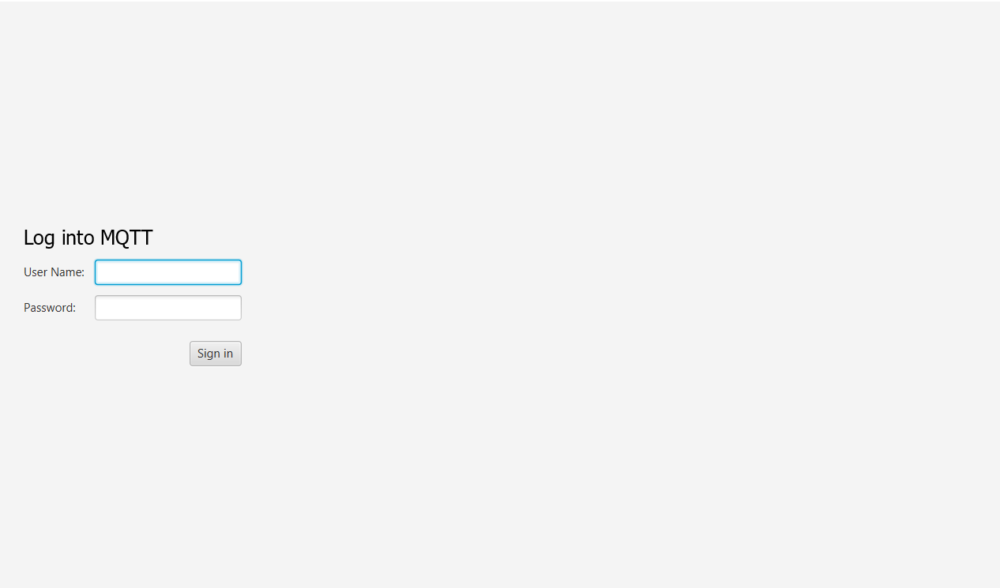
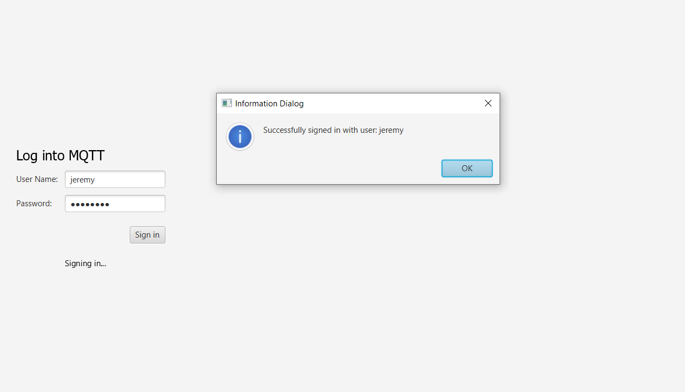
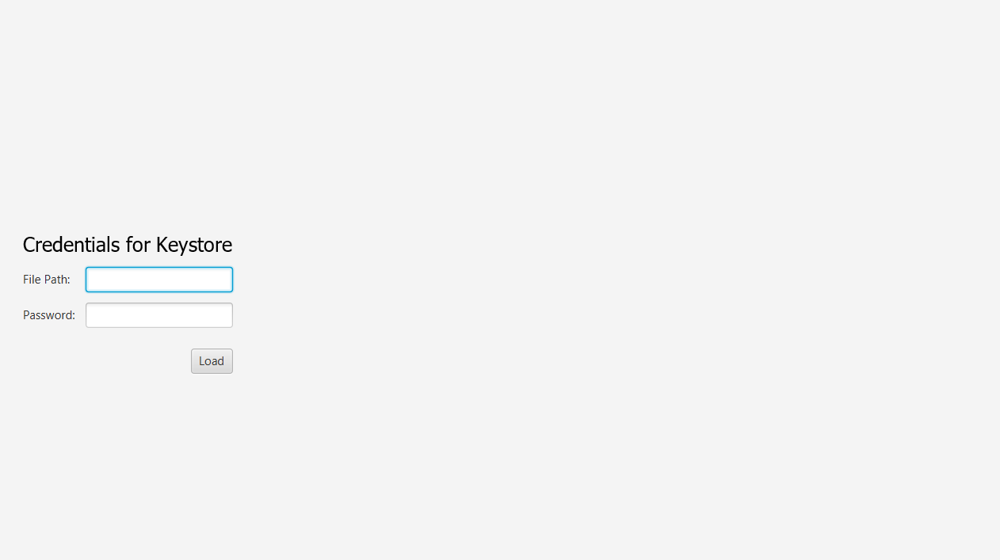
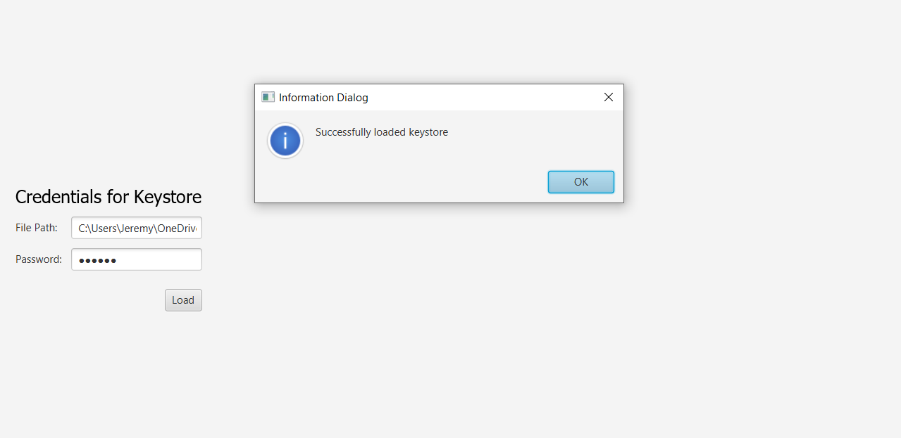
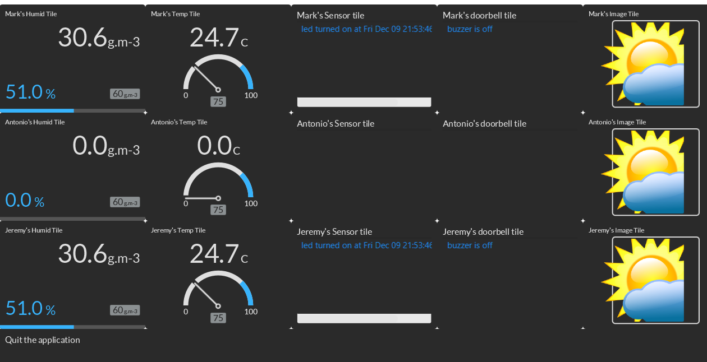

# Data Communications and Networking Final Project

## Project Overview

## Notice
- Since we are using mock data, some classes are not needed:
    - Camera 
    - CameraApp
    - ProccessBulder
    - Application
    - ProccessCode
    - Component
## Before running the project:
1. If path in line 184 of MyMqtt.java does not work properly, change it to an absolute path until it reaches defaultImage/newImage.png
2. If path in line 225 of Threads.java does not work properly, change it to an absolute path until it reaches defaultImage/sunny-clip-art.png

For PiKeyStoreTest.java test class, it might be necessary to modify the `relPath` variable to the absolute path leading to `\src\test\java\com\mycompany\finalproject\` in order for tests to pass.

## To run the project:
1. Go to the terminal and locate the project. Once in the project, type "mvn clean package", then press Enter.
2. When you are using Netbeans, click on the project to select it, press the right click of the mouse, and there should be a "Run" option, then click the  Run option.
3. When you are using the Vscode, open the FinalProject.java file, in the top right, there is a Run button to be clicked.

Note: Use MQTT Credentials given [below](#mqtt-credentials) to sign in

## GitLab Repo:
https://gitlab.com/jeremytang03/data-comm-final-project

## Team Members:
- Mark Agluba 
- Jeremy Tang, 
- Antonio Simonelli

## MQTT Credentials
- username: MarkisAwesome, password: dawson1234
- username: jeremy, password: tang1234
- username: asimonelli, password: dawson1234

